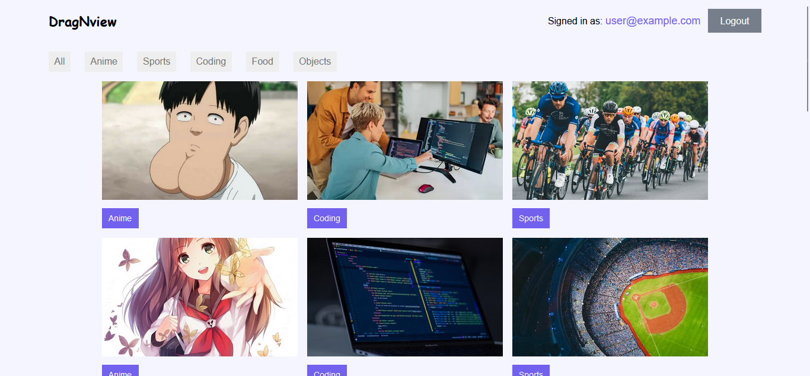

# DragNview

MovieBox is a web application built with Reactjs and TypeScript that allows users to discover images, rearrange them it also has a search feature



## Current Features

- Display movies.
- Rearrange images.
- Filter Images.

## Future Features
- Upload images
- Delete images

## Demo

You can view the live demo of the project [here](https://dragnview-ddd00.web.app/).

## Technologies Used

- [Reactjs 13](https://react.dev)
- [TypeScript](https://www.typescriptlang.org/)
- [React Icons](https://react-icons.github.io/react-icons/)

## Getting Started

To run this project locally, follow these steps:

1. Clone the repository:

   ```bash
   git clone https://github.com/adeyemialameen04/DragNDrop.git
   ```

2. Navigate to the project directory:
   ```bash  
   cd DragNDrop 
   ```

3. Install dependencies:
   ```bash  
   npm install
   # or
   yarn install
   ```

4. Set up your TMDB API key:
- Visit Firebase website to obtain an API key.
- Create a .env file in the root directory of your project.
- Add your API key from the web sdk configuration to the .env file:   
```env

VITE_FIREBASE_API_KEY=your_api_key_here
```

5. Run the development server:

   ```bash
   npm run dev
   # or
   yarn dev
   ```

6. Open your browser and access the app at [http://localhost:5173](http://localhost:5173).

## Usage

- **Home Page**: The homepage displays a random images that may be filterd by tags.

- **Search**: Users can search for images by using tags.

## Contributing

Contributions are welcome! If you would like to contribute to MovieBox, please follow these steps:

1. Fork the repository.
2. Create a new branch for your feature or bug fix: `git checkout -b feature/new-feature`.
3. Make your changes and commit them: `git commit -m 'Add new feature'`.
4. Push to your branch: `git push origin feature/new-feature`.
5. Open a pull request on the main repository.

## License

This project is licensed under the MIT License - see the [LICENSE](LICENSE) file for details.
